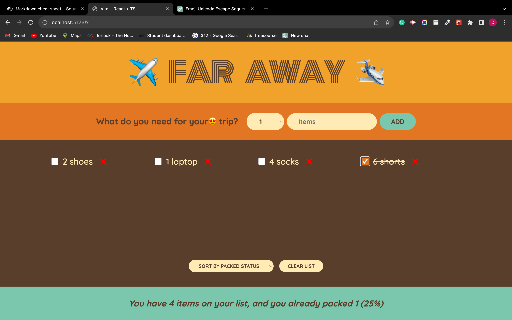
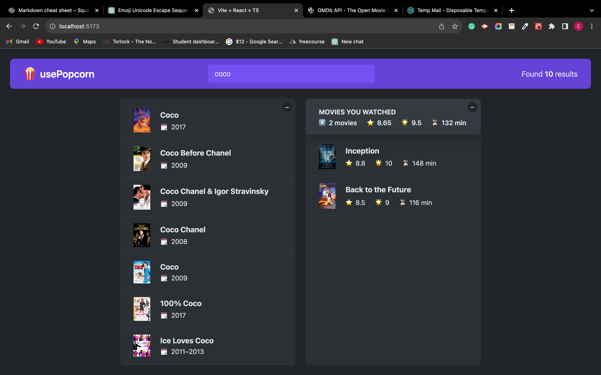

# All My React Projects

## Beginner

1. pizza menu.
   - components
   - prop
     
2. steps
   - states
   - events
   - form interactive components
     
3. travel-planner
   - states
   - data-flow
   - state management
     

## Intermediate

1. popcorn-box

- effects: userEffect
  

## Advance

1. worldwise

- effects: userEffect
- contextApi
- reducers and useReducer
- leafleat
  
  
  
  
  
